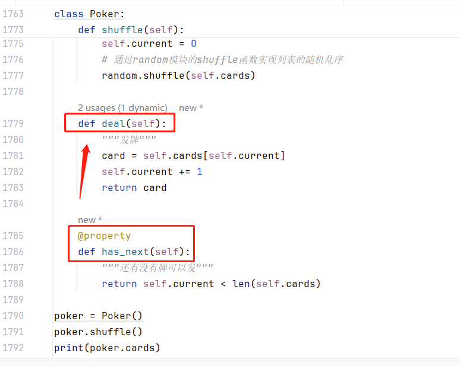

# Tips

- print函数中的end=''表示输出后不换行，即将默认的结束符\n（换行符）更换为''（空字符）。
- id：查看对象在内存中的位置（逻辑地址）

# 修改包下载的源为国内的源

```python
pip config set global.index-url https://pypi.doubanio.com/simple
```

# 更好的交互环境

```python
pip install ipython
# pip unstall ipython
```

# Python Tutor

https://pythontutor.com/

# 变量类型转换

```python
type()
int()   # 数值或字符串 → 整数，可以指定进制。
float() # 字符串 → 浮点数。
str()   # 指定的对象 → 字符串形式，可以指定编码。
chr()   # 整数 → 该编码对应的字符串（一个字符）。
ord()   # 字符串（一个字符） → 对应的编码（整数）。
```

# 算术运算

```python
print(321 + 123)     # 加法运算
print(321 - 123)     # 减法运算
print(321 * 123)     # 乘法运算
print(321 / 123)     # 除法运算
print(321 % 123)     # 求模运算
print(321 // 123)    # 整除运算
print(321 ** 123)    # 求幂运算
```

# 列表

```python
list(range(1, 10))  # [1, 2, 3, 4, 5, 6, 7, 8, 9]
list('hello')       # ['h', 'e', 'l', 'l', 'o']
```

# 元组

## 元组和列表的比较
1.元组是不可变类型，**不可变类型更适合多线程环境**，因为它降低了并发访问变量的同步化开销。关于这一点，我们会在后面讲解多线程的时候为大家详细论述。
2.元组是不可变类型，**通常不可变类型在创建时间和占用空间上面都优于对应的可变类型**。我们可以使用sys模块的getsizeof函数来检查保存相同元素的元组和列表各自占用了多少内存空间。我们也可以使用timeit模块的timeit函数来看看创建保存相同元素的元组和列表各自花费的时间，代码如下所示。

# 分析内存大小和运算时间

```python
import sys
import timeit

a = list(range(100000))
b = tuple(range(100000))
print(sys.getsizeof(a), sys.getsizeof(b))    # 900120 800056

print(timeit.timeit('[1, 2, 3, 4, 5, 6, 7, 8, 9]'))
print(timeit.timeit('(1, 2, 3, 4, 5, 6, 7, 8, 9)'))
```

# 字符串

- **==**：比较编码
- **is**：比较内存地址
- 字符串是不可变类型，所以不能通过索引运算修改字符串中的字符

```python
ord()   # 获取文本编码
```

## 格式化字符串


| 变量值      | 占位符     | 格式化结果    | 说明 |
| ----------- | ---------- | ------------- | ---- |
| `3.1415926` | `{:.2f}`   | `'3.14'`      | 保留小数点后两位 |
| `3.1415926` | `{:+.2f}`  | `'+3.14'`       | 带符号保留小数点后两位 |
| `-1`        | `{:+.2f}`  | `'-1.00'` | 带符号保留小数点后两位 |
| `3.1415926` | `{:.0f}`   | `'3'` | 不带小数 |
| `123`       | `{:0>10d}` | `'0000000123'` | 左边补`0`，补够10位 |
| `123`       | `{:x<10d}` | `'123xxxxxxx'` | 右边补`x` ，补够10位 |
| `123`       | `{:>10d}`  | `'       123'` | 左边补空格，补够10位 |
| `123`       | `{:<10d}` | `'123       '` | 右边补空格，补够10位 |
| `123456789` | `{:,}`     | `'123,456,789'` | 逗号分隔格式 |
| `0.123`     | `{:.2%}`   | `'12.30%'`    | 百分比格式 |
| `123456789` | `{:.2e}`   | `'1.23e+08'`  | 科学计数法格式 |

# 集合

- 集合的成员运算在性能上要优于列表的成员运算
- 集合中的元素必须是hashable类型。
  - **hashable类型**：指的是能够计算出哈希码的数据类型，大家可以暂时将哈希码理解为和变量对应的唯一的ID值。
  - **通常不可变类型都是hashable类型**，如整数、浮点、字符串、元组等，而可变类型都不是hashable类型，因为可变类型无法确定唯一的ID值，所以也就不能放到集合中。
  - **集合本身也是可变类型**，所以集合不能够作为集合中的元素，这一点在使用集合的时候一定要注意。
- 与列表不同的地方在于集合中的元素**没有序**、**不能用索引运算**、**不能重复**。


# 字典

- 字典中的键必须是不可变类型；值可以不是

# 函数

- 可以使用**sys**模块的**setrecursionlimit**函数来改变递归调用的最大深度，例如：sys.setrecursionlimit(10000)，但是不建议这样做，因为让递归快速收敛才是我们应该做的事情，否则就应该考虑使用循环递推而不是递归。
- 
| 函数    | 说明                                                         |
| ------- | ------------------------------------------------------------ |
| `abs`   | 返回一个数的绝对值，例如：`abs(-1.3)`会返回`1.3`。           |
| `bin`   | 把一个整数转换成以`'0b'`开头的二进制字符串，例如：`bin(123)`会返回`'0b1111011'`。 |
| `chr`   | 将Unicode编码转换成对应的字符，例如：`chr(8364)`会返回`'€'`。 |
| `hex`   | 将一个整数转换成以`'0x'`开头的十六进制字符串，例如：`hex(123)`会返回`'0x7b'`。 |
| `input` | 从输入中读取一行，返回读到的字符串。                         |
| `len`   | 获取字符串、列表等的长度。                                   |
| `max`   | 返回多个参数或一个可迭代对象中的最大值，例如：`max(12, 95, 37)`会返回`95`。 |
| `min`   | 返回多个参数或一个可迭代对象中的最小值，例如：`min(12, 95, 37)`会返回`12`。 |
| `oct`   | 把一个整数转换成以`'0o'`开头的八进制字符串，例如：`oct(123)`会返回`'0o173'`。 |
| `open`  | 打开一个文件并返回文件对象。                                 |
| `ord`   | 将字符转换成对应的Unicode编码，例如：`ord('€')`会返回`8364`。 |
| `pow`   | 求幂运算，例如：`pow(2, 3)`会返回`8`；`pow(2, 0.5)`会返回`1.4142135623730951`。 |
| `print` | 打印输出。                                                   |
| `range` | 构造一个范围序列，例如：`range(100)`会产生`0`到`99`的整数序列。 |
| `round` | 按照指定的精度对数值进行四舍五入，例如：`round(1.23456, 4)`会返回`1.2346`。 |
| `sum`   | 对一个序列中的项从左到右进行求和运算，例如：`sum(range(1, 101))`会返回`5050`。 |
| `type`  | 返回对象的类型，例如：`type(10)`会返回`int`；而` type('hello')`会返回`str`。 |

- random模块的sample和choices函数都可以实现随机抽样，sample实现无放回抽样，这意味着抽样取出的字符是不重复的；choices实现有放回抽样，这意味着可能会重复选中某些字符。这两个函数的第一个参数代表抽样的总体，而参数k代表抽样的数量。

# 面向对象

- 软件工程的经典著作《人月神话》
- 编程范式：**面向对象编程**、**指令式编程**、**函数式编程**等。
- 在面向对象编程的世界里，程序中的数据和操作数据的函数是一个逻辑上的整体，我们称之为对象，对象可以接收消息，解决问题的方法就是创建对象并向对象发出各种各样的消息
- 面向对象编程：把一组数据和处理数据的方法组成对象，把行为相同的对象归纳为类，通过封装隐藏对象的内部细节，通过继承实现类的特化和泛化，通过多态实现基于对象类型的动态分派。
- 对象（object）、类（class）、封装（encapsulation）、继承（inheritance）、多态（polymorphism）。
- 类是对象的蓝图和模板，对象是类的实例，是可以接受消息的实体。
- 一切皆为对象，对象都有属性和行为，每个对象都是独一无二的，而且对象一定属于某个类。
- 写在类里面的函数我们通常称之为**方法**，方法就是对象的行为，也就是对象可以接收的消息。
- 方法的第一个参数通常都是self，它代表了接收这个消息的对象本身。
- **魔术方法**或**魔法方法**：以两个下划线__（读作“dunder”）开头和结尾的方法通常都是有特殊用途和意义的方法；在打印对象的时候不希望看到对象的地址而是看到我们自定义的信息，可以通过在类中放置__repr__魔术方法来做到。
- 对象方法、类方法、静态方法都可以通过类名.方法名的方式来调用，区别在于方法的**第一个参数到底是普通对象还是类对象，还是没有接受消息的对象**。静态方法通常也可以直接写成一个独立的函数，因为它并没有跟特定的对象绑定。
- 面向对象的支柱：
  - **封装**
    - 装饰器
      - @staticmethod：申明静态方法
      - @classmethod：申明类方法
  - **继承**
    - 一个类可以有一个或多个父类
    - **里氏替换原则（Liskov Substitution Principle）**：在实际开发中，用子类对象去替换掉一个父类对象
  - **多态**
    - 子类继承父类的方法后，还可以对方法进行重写（重新实现该方法），不同的子类可以对父类的同一个方法给出不同的实现版本
- 类和类之间的关系可以粗略的分为**is-a关系（继承）**、**has-a关系（关联）**和**use-a关系（依赖）**
- **运算符重载**：Python中要实现对<运算符的重载，需要在类中添加一个名为__lt__的魔术方法。很显然，魔术方法__lt__中的lt是英文单词“less than”的缩写，以此类推，魔术方法__gt__对应>运算符，魔术方法__le__对应<=运算符，__ge__对应>=运算符，__eq__对应==运算符，__ne__对应!=运算符。
- 将一个方法定义成属性后，可以控制另一个循环


# Python标准库

## collections - 容器数据类型模块

- `namedtuple`：命令元组，它是一个类工厂，接受类型的名称和属性列表来创建一个类。
- `deque`：双端队列，是列表的替代实现。Python中的列表底层是基于数组来实现的，而`deque`底层是双向链表，因此当你需要在头尾添加和删除元素是，`deque`会表现出更好的性能，渐近时间复杂度为$O(1)$。
- `Counter`：`dict`的子类，键是元素，值是元素的计数，它的`most_common()`方法可以帮助我们获取出现频率最高的元素。`Counter`和`dict`的继承关系我认为是值得商榷的，按照CARP原则，`Counter`跟`dict`的关系应该设计为关联关系更为合理。
- `OrderedDict`：`dict`的子类，它记录了键值对插入的顺序，看起来既有字典的行为，也有链表的行为。
- `defaultdict`：类似于字典类型，但是可以通过默认的工厂函数来获得键对应的默认值，相比字典中的`setdefault()`方法，这种做法更加高效。

## random - 随机数和随机抽样模块

这个模块我们之前已经用过很多次了，生成随机数、实现随机乱序和随机抽样，下面是常用函数的列表。

- `getrandbits(k)`：返回具有`k`个随机比特位的整数。
- `randrange(start, stop[, step])`：从`range(start, stop, step)` 返回一个随机选择的元素，但实际上并没有构建一个`range`对象。
- `randint(a, b)`：返回随机整数`N`满足`a <= N <= b`，相当于`randrange(a, b+1)`。
- `choice(seq)`：从非空序列`seq`返回一个随机元素。 如果`seq`为空，则引发`IndexError`。
- `choices(population, weight=None, *, cum_weights=None, k=1)`：从`population`中选择替换，返回大小为`k`的元素列表。 如果`population`为空，则引发`IndexError`。
- `shuffle(x[, random])`：将序列`x`随机打乱位置。
- `sample(population, k)`：返回从总体序列或集合中选择`k`个不重复元素构造的列表，用于无重复的随机抽样。
- `random()`：返回`[0.0, 1.0)`范围内的下一个随机浮点数。
- `expovariate(lambd)`：指数分布。
- `gammavariate(alpha, beta)`：伽玛分布。
- `gauss(mu, sigma)` / `normalvariate(mu, sigma)`：正态分布。
- `paretovariate(alpha)`：帕累托分布。 
- `weibullvariate(alpha, beta)`：威布尔分布。

## os.path - 路径操作相关模块

`os.path`模块封装了操作路径的工具函数，如果程序中需要对文件路径做拼接、拆分、获取以及获取文件的存在性和其他属性，这个模块将会非常有帮助，下面为大家罗列一些常用的函数。

- `dirname(path)`：返回路径`path`的目录名称。
- `exists(path)`：如果`path`指向一个已存在的路径或已打开的文件描述符，返回 `True`。
- `getatime(path)` / `getmtime(path)` / `getctime(path)`：返回`path`的最后访问时间/最后修改时间/创建时间。
- `getsize(path)`：返回`path`的大小，以字节为单位。如果该文件不存在或不可访问，则抛出`OSError`异常。
- `isfile(path)`：如果`path`是普通文件，则返回 `True`。
- `isdir(path)`：如果`path`是目录（文件夹），则返回`True`。
- `join(path, *paths)`：合理地拼接一个或多个路径部分。返回值是`path`和`paths`所有值的连接，每个非空部分后面都紧跟一个目录分隔符 (`os.sep`)，除了最后一部分。这意味着如果最后一部分为空，则结果将以分隔符结尾。如果参数中某个部分是绝对路径，则绝对路径前的路径都将被丢弃，并从绝对路径部分开始连接。
- `splitext(path)`：将路径`path`拆分为一对，即`(root, ext)`，使得`root + ext == path`，其中`ext`为空或以英文句点开头，且最多包含一个句点。

## uuid - UUID生成模块

`uuid`模块可以帮助我们生成全局唯一标识符（Universal Unique IDentity）。该模块提供了四个用于生成UUID的函数，分别是：

- `uuid1()`：由MAC地址、当前时间戳、随机数生成，可以保证全球范围内的唯一性。
- `uuid3(namespace, name)`：通过计算命名空间和名字的MD5哈希摘要（“指纹”）值得到，保证了同一命名空间中不同名字的唯一性，和不同命名空间的唯一性，但同一命名空间的同一名字会生成相同的UUID。
- `uuid4()`：由伪随机数生成UUID，有一定的重复概率，该概率可以计算出来。
- `uuid5()`：算法与`uuid3`相同，只不过哈希函数用SHA-1取代了MD5。

由于`uuid4`存在概率型重复，那么在真正需要全局唯一标识符的地方最好不用使用它。在分布式环境下，`uuid1`是很好的选择，因为它能够保证生成ID的全局唯一性。下面是在**Python交互式环境中**使用`uuid1`函数生成全局唯一标识符的例子。

# 异常处理机制

- Python中和异常相关的关键字有五个，分别是**try**、**except**、**else**、**finally**和**raise**，我们先看看下面的代码，再来为大家介绍这些关键字的用法。
- raise关键字可以用来引发异常（抛出异常对象）;try...except...结构可以用来捕获并处理异常
- 异常类型
```python
BaseException
 +-- SystemExit
 +-- KeyboardInterrupt
 +-- GeneratorExit
 +-- Exception
      +-- StopIteration
      +-- StopAsyncIteration
      +-- ArithmeticError
      |    +-- FloatingPointError
      |    +-- OverflowError
      |    +-- ZeroDivisionError
      +-- AssertionError
      +-- AttributeError
      +-- BufferError
      +-- EOFError
      +-- ImportError
      |    +-- ModuleNotFoundError
      +-- LookupError
      |    +-- IndexError
      |    +-- KeyError
      +-- MemoryError
      +-- NameError
      |    +-- UnboundLocalError
      +-- OSError
      |    +-- BlockingIOError
      |    +-- ChildProcessError
      |    +-- ConnectionError
      |    |    +-- BrokenPipeError
      |    |    +-- ConnectionAbortedError
      |    |    +-- ConnectionRefusedError
      |    |    +-- ConnectionResetError
      |    +-- FileExistsError
      |    +-- FileNotFoundError
      |    +-- InterruptedError
      |    +-- IsADirectoryError
      |    +-- NotADirectoryError
      |    +-- PermissionError
      |    +-- ProcessLookupError
      |    +-- TimeoutError
      +-- ReferenceError
      +-- RuntimeError
      |    +-- NotImplementedError
      |    +-- RecursionError
      +-- SyntaxError
      |    +-- IndentationError
      |         +-- TabError
      +-- SystemError
      +-- TypeError
      +-- ValueError
      |    +-- UnicodeError
      |         +-- UnicodeDecodeError
      |         +-- UnicodeEncodeError
      |         +-- UnicodeTranslateError
      +-- Warning
           +-- DeprecationWarning
           +-- PendingDeprecationWarning
           +-- RuntimeWarning
           +-- SyntaxWarning
           +-- UserWarning
           +-- FutureWarning
           +-- ImportWarning
           +-- UnicodeWarning
           +-- BytesWarning
           +-- ResourceWarning
```

# 上下文语法

- 对于open函数返回的文件对象，还可以使用with上下文语法在文件操作完成后自动执行文件对象的close方法，这样可以让代码变得更加简单优雅，因为不需要再写finally代码块来执行关闭文件释放资源的操作。
- 并不是所有的对象都可以放在with上下文语法中，只有符合上下文管理器协议（有**__enter__**和**__exit__**魔术方法）的对象才能使用这种语法，Python标准库中的contextlib模块也提供了对with上下文语法的支持，后面再为大家进行讲解。

# 对象的序列化和反序列化

- [JSON的官方网站](https://www.json.org/json-zh.html)


